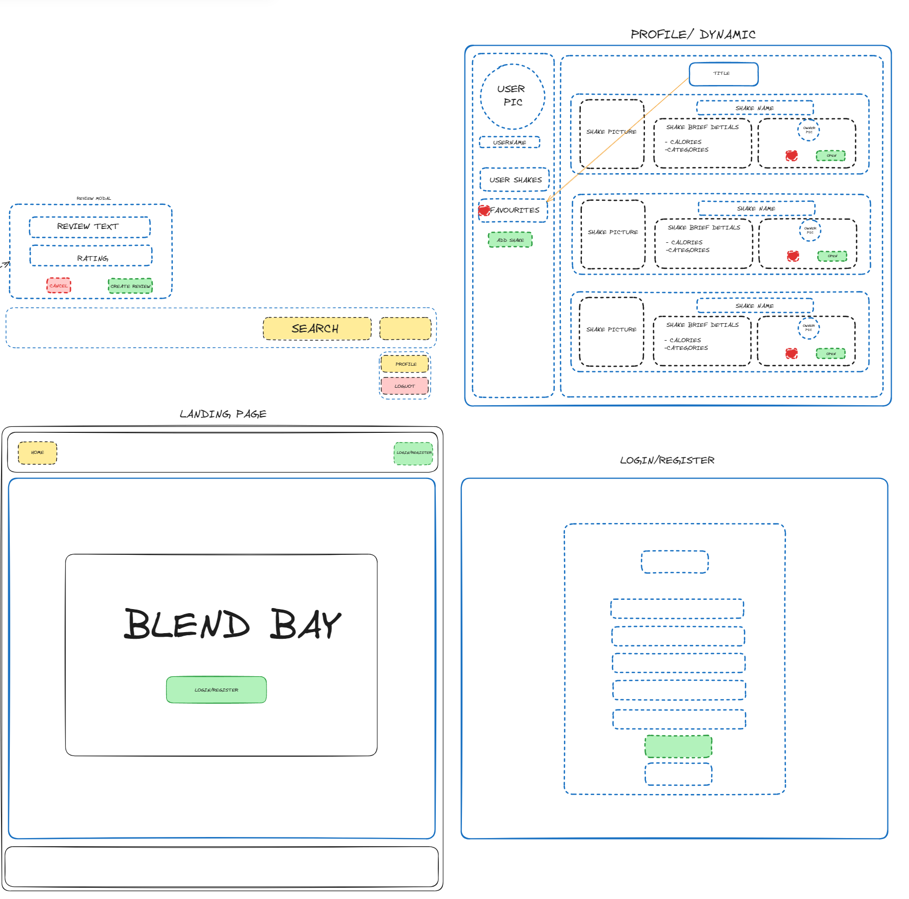

## Description
As my final project I decided on evolving and building up on Project 3 with a couple more inclusions that I was not able to fit in the last time. We approached week 11 of our 12 week course covering Python and Django with the implementation of them as part of our back-end.
Here I've chosen to work on a website for all kinds of shakes. With the aim to allow users to create,update, delete,favourite and much more! React on the Front-End and Django handling the Back-End. 

---

## Deployment link
The project is available to view on my Github page. Link below :-
https://github.com/8055-NVW/Project-4-Blend-Bay    

Blend Bay can experienced from the link below:- 
https://blend-bay-155603fbccf6.herokuapp.com/                                                 

---
## Getting Started/Code Installation
Below are packages required to get up and running with the project development :-

##### Front-End
- npm install -g npm@latest   
- npx create-vite@latest client
- npm i axios 
- npm i react-router-dom       
- npm run dev    

##### Back-End
- Pipenv install django
- Pipenv shell
- Pipenv install install psycopg2-binary
- Pipenv install pylint
- python manage.py runserver

---

## Timeframe & Working Team (Solo/Pair/Group)
This was a Solo project. We were allotted one week.

---
## Technologies Used	
##### Back-end
- Python
- Pylint
- psycopg2-binary
- Django
- Django AllAuth
- PostgreSQL
- SQL

##### Front-End
- React
- JavaScript
- HTML
- CSS
- SCSS
- Vite
- JWT
- Axios
- Material UI	
	
##### Development
- Visual Studio Code - For writing code
- Chrome - For debugging
- Insomnia - For Testing Endpoints
- TablePlus - For testing and managing the Database 
- Neon - for PostgreSQL database
- Cloudinary - For hosting the images
- Hekate - For final Deployment
- GitHub - For version control and Branch Control

---
## Brief

The project name I chose was Blend Bay.  A website to Like, Share, Review and Rate Shakes of all categories. I went through most of my day trying to figure out what the concept of the website should be and ironically had my eureka moment while having my Banana Vanilla Protein Shake. 

---
## Goals:-
- Use Material UI this time around to get more comfortable with new frameworks.
- Implement Google OAUTH as a login alternative for the user
- Explore reusing components in React with the aim to familiarise myself with React components modular nature.

---
## Planning

**Project Wireframe -**

**Project ERD -**

**Project Trello -**

---
## Build/Code Process
- **Day 1:** 
Concept study of previous projects
Looked at previous projects to get  a good idea of what i would like to accomplish with the next project
Decide a theme for the project. The content was arbitrary here with more priority given to context and functionality.
Decide on what feature to implement. 
Draw out a loose wireframe for the structure and pages of the website
Create draft for the models to i would utilise in the project

- **Day 2:** 
Project Setup and Kick-off Backend 
Created the GitHub Repo for the project and cloned it locally.
Started work on the backend creating the models and connections with a database diagram.  
Started off work on Back-end with models for users, shakes and reviews
Started checking endpoints 

- **Day 3:** 
Complete logic for back-end
Added additional changes to models for more populated views. Wanted to have a single request to get as much data as possible. 
Completed check of endpoints via insomnia
Attempt implementation of Google OAUTH
Research Material Ui for implementation

- **Day 4:** 
Finish Back-end / Begin on Client Side
Managed to get  Google OAuth working successfully on the back-end.
Gathered final seed data.
Pushed to the Development Branch .
Started setting up the client side environment to begin working on the front-end code.
Defined the multiple pages / routes of the site.

- **Day 5:** 
Building on Client Side / OAUTH on front-end
Finished designing the Landing Page
Completed design of the Header and Footer
Finished Design of the Login/Register Page to implement Google OAUTH on the front-end.
Connect Cloudinary for image upload.
Attempt implementation of Google OAUTH on the login/ register page.

- **Day 6:** 
Insure CRUD is met
Unsuccessful with implementation of Google Oauth on front-end.(commented out to ensure mnp is met first)
Connect routes to nav and landing page links.
Design Home Feed page.
Added Add/Update Shake page.
Created Shake Single View page.
Add Reviews to Shake View Page.
Add Dynamic Buttons Component.
Added Functionality to Favourite Shake.

- **Day 7 :** 
Complete profile views / Complete Design Touches
Added ability to delete Reviews
Completed dynamic profile page.
Completed search bar and logic.
Added Styling touches to the project.

---
## Challenges
The primary challenge that I encountered during this process was the implementation of Google OAUTH 2.0. The documentation and resources available from Google weren't clear enough to define implementation for the project context. (django backend with django allauth to implement Oauth on backend and react front-end with an existing login process. I was successful using AllAuth on the back-end but ran into issues on the front-end.

Using Material UI - Is a component library that was new to me in this project. While it was not a requirement for the project I really liked Material UI visually and wanted to push myself to learn a bit more for this one.

Reusing components - This being my third implementation of React. I approached this with the aim of reusing components as much as possible (within reason 🙂) . While smart, it added a level of complexity to the project that meant I frequent errors to handle. Especially with passing the right props down.

---
## Wins
I'm quite happy with the implementation of Material UI in the project. Overall I was able to style the majority of the components exactly how I wanted them to be with the exception of the profile view page which was very tricky with the “tabs” component.

Component Modularity - in short being able to apply and reuse components was a personal goal from the start and being able to successfully apply it in my final project helped me feel a lot more comfortable working with react.

Google OAuth implementation on the back-end. While I was not able to integrate O-Auth into this project, being on the timeframe we allowed, I'm confident in its application and feel a step close to implementing it in the future. The back-end was successful and I take that as a win even if it's a small one. 

---
## Key Learnings/Takeaways
- The project from start to finish would not be possible without following a solid methodology to ensure everything is taken step by step to accomplish smaller goals at a time. 

- Using Trello to track and manage tasks has been a great asset in the development process.

- Always read through documentation before implementation so as to have a clear idea if implementation is viable in the time you have. In regards to this I spent a considerable amount of time attempting to implement Google OAuth on the front end and because of the lack of time and its implementation not being critical, I made a decision to omit it from final submission. However without time constraints, implementation would have been possible.

---
## Bugs
- One main bug is the media query for screens larger than 1200px. I have found the issue and aim to correct it in its next iteration.

---
## Future Improvements
- Fix the large screen media query bug to centre the content on screens above 1200px

- Add a spinner icon to the content on the load screen so the load-in feels more smoother.
